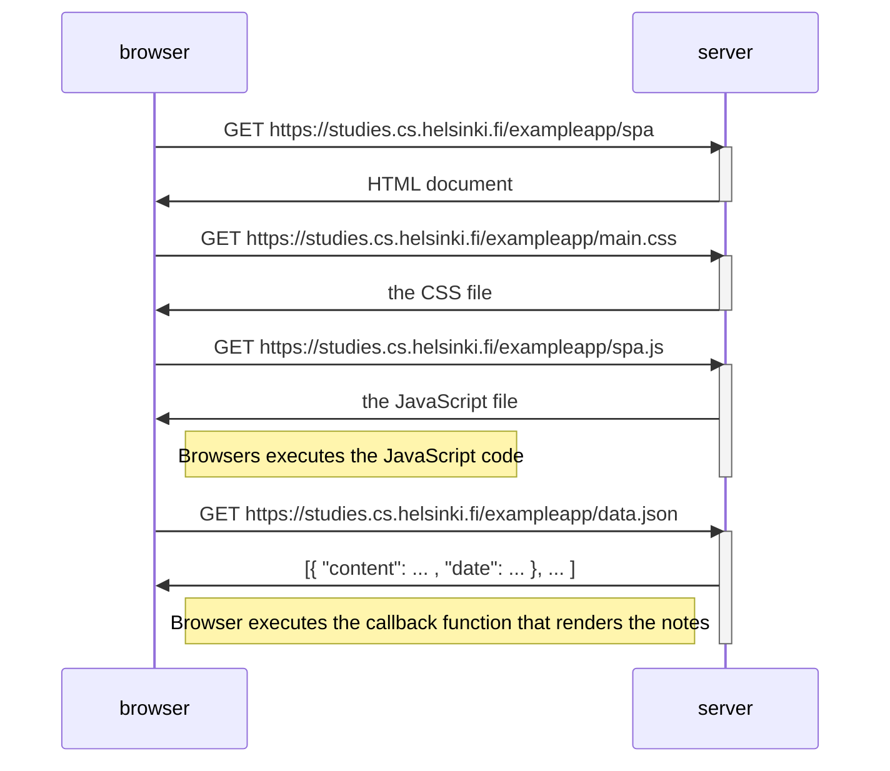

```mermaid

    sequenceDiagram
    participant browser
    participant server

    browser ->> server: GET https://studies.cs.helsinki.fi/exampleapp/spa

    activate server
    server ->> browser: HTML document

    deactivate server

    browser ->> server: GET https://studies.cs.helsinki.fi/exampleapp/main.css

    activate server
    server ->> browser: the CSS file
    deactivate server

    browser ->> server: GET https://studies.cs.helsinki.fi/exampleapp/spa.js


    activate server
    server ->> browser: the JavaScript file

    Note right of browser: Browsers executes  the JavaScript code

    deactivate server


    browser ->> server: GET https://studies.cs.helsinki.fi/exampleapp/data.json


    activate server
    server ->> browser: [{ "content": ... , "date": ... }, ... ]

    Note right of browser: Browser executes the callback function that renders the notes

    deactivate server

```
