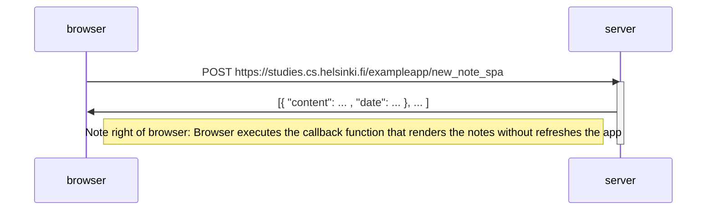

```mermaid

    sequenceDiagram
    participant browser
    participant server

    browser ->> server: POST https://studies.cs.helsinki.fi/exampleapp/new_note_spa

    activate server
    server ->> browser: [{ "content": ... , "date": ... }, ... ]

    Note right of browser: Note right of browser: Browser executes the callback function that renders the notes without refreshes the app

    deactivate server

```
